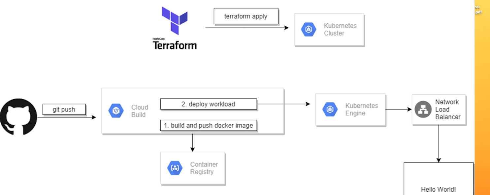

## Introduction
The purpose of this document is to provide a comprehensive guide for deploying the ABC Article API, which includes creating a Docker image, deploying the backend and setting up a Google Kubernetes Engine (GKE) cluster. This guide will cover the following sections:
- Building the Docker Image
- Deploying the Backend
- Setting up a Google Kubernetes Engine (GKE) Cluster
- Deploying the API on a GKE Cluster

## Docker Deployment
Build the dockerfile with 'docker build -t devops/article-api:latest .'
The Dockerfile included in this project will build a Docker image for the RESTful API. The Docker image is then pushed to Google Container Registry (GCR) for deployment to Google Kubernetes Engine (GKE).

## Terraform Deployment

The Terraform code in this project sets up the following infrastructure on Google Cloud Platform:
- Google Container Registry (GCR) repository for storing the Docker image
- Google Kubernetes Engine (GKE) cluster for deploying the Docker image
- Service for accessing the RESTful API over the internet

Terraform veriables
```
PROJECT_ID: GloverTest
REGION: europe-west1
REPOSITORY_NAME: abc-article-api
CLUSTER_NAME: glovertest
NODE_POOL_NAME: abc-glover
SERVICE_NAME: article-api
IMAGE_NAME: devops/article-api
TAG: latest
PORT_NAME: devops-article-api
PORT_NUMBER: 5001
```


## How to use

1. Clone this repository to your local machine
2. Modify the `variables.tf` file to include your desired project ID, region, repository name, cluster name, node pool name, service name, image name, tag, port name, and port number.
3. Run `terraform init` to initialize Terraform and download necessary plugins
4. Run `terraform apply` to deploy the infrastructure to Google Cloud Platform
5. Access the RESTful API at the external IP address of the service

## Architecture Diagram

A sample architecture diagram is provided to give an overview of the deployment process. The diagram includes the components of the Docker deployment and Terraform deployment.



## Test
I connected the dns by the loadbalancer to my own domain but I didn’t configure the domain for ssl (https)
go to http://glovertest.charitooconstructions.com.ng
